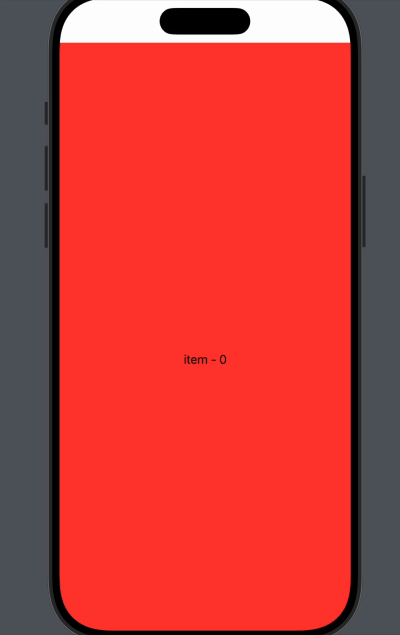

# VerticalPage

🎬 **VerticalPage** — кастомная реализация вертикальной видеоленты в стиле **Instagram Reels** / **TikTok** на iOS.  
Поддерживает автоплей видео, вертикальную пагинацию, переиспользование плееров и плавный UX.

## 📸 Превью

<!-- Замените ссылку на вашу gif/demo -->

## 🚀 Возможности

- Вертикальная прокрутка видео (постраничная)
- Автоматическое воспроизведение текущей ячейки
- Пауза и остановка видео при смене страницы
- Переиспользование AVPlayer'ов для экономии памяти

## 🛠 Стек технологий

- `SwiftUI`
- `AVFoundation`
- `Observer Pattern` для управления состоянием
- Минимальная поддержка: iOS 14+
